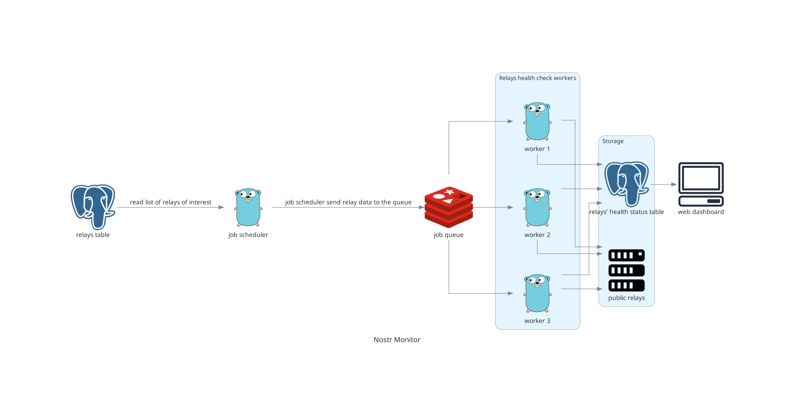

Nostr Monitor
=============

> NIP-66 Relay Monitor Architecture

# NIP-66 Relay Monitor Architecture

A scalable, distributed system for monitoring Nostr relays and publishing NIP-66 discovery events.

## Overview

This system monitors Nostr relays for availability and performance, automatically publishing NIP-66 events (kinds 10166 and 30166) to help users discover reliable relays. The architecture separates concerns between scheduling, job distribution, and relay checking for optimal scalability and fault tolerance.

## System Components

### Job Scheduler (Go)
The **Go scheduler** serves as the system coordinator:
- **Cron-based timing**: Triggers monitoring cycles every 15 minutes (configurable)
- **Relay management**: Loads enabled relays from PostgreSQL
- **Job creation**: Creates individual check jobs for each relay
- **Queue management**: Pushes jobs to Redis queue for worker consumption
- **System coordination**: Publishes 10166 monitor announcements
- **Cycle monitoring**: Ensures frequency commitments are met

### Job Queue (Redis)
**Redis** handles job distribution and coordination:
- **Job storage**: Queues relay check jobs with metadata (URL, timeouts, checks to perform)
- **Load balancing**: Distributes jobs across available workers
- **Retry logic**: Handles failed jobs with exponential backoff
- **Priority queues**: Supports different priority levels for critical relays
- **Dead letter queue**: Captures permanently failed jobs for analysis
- **Rate limiting**: Prevents overwhelming target relays

### Worker Pool (Go)
**Go workers** perform the actual relay monitoring:
- **Concurrent processing**: Each worker handles multiple relay checks using goroutines
- **Health checks**: Performs WebSocket connection, read, write, and NIP-11 tests
- **Goroutine-based I/O**: Leverages Go's lightweight concurrency for network operations
- **Immediate publishing**: Signs and publishes 30166 events directly upon successful checks
- **Result storage**: Saves check results to PostgreSQL
- **Job completion**: Updates Redis with job status and completion

### Data Storage

#### PostgreSQL
Primary database for persistent storage:
- **Relay configuration**: URLs, settings, metadata
- **Check results**: Historical performance and status data
- **Monitor configuration**: System settings and timeouts
- **Event tracking**: Record of published Nostr events

#### Redis Cache
High-performance caching layer:
- **Recent results**: Fast access to latest relay status
- **Job status**: Real-time job queue monitoring
- **Performance metrics**: Quick lookup for response times and statistics

### Publishing Layer

#### Workers → Nostr Network
Workers publish 30166 events immediately:
- **Real-time updates**: Events published as soon as relays are confirmed online
- **Direct publishing**: No intermediate batching or coordination delays
- **Distributed load**: Publishing workload spreads across all workers
- **Fault isolation**: Individual worker failures don't block other publications

#### Go Coordinator
Handles system-level publishing:
- **Monitor announcements**: Publishes 10166 events declaring monitoring intent
- **System maintenance**: Cleanup tasks and database maintenance
- **Monitoring dashboards**: Feeds data to web interfaces

## Data Flow

1. **Timer Trigger**: Every 15 minutes, the Go scheduler activates
2. **Relay Loading**: Scheduler reads enabled relays from PostgreSQL
3. **Job Creation**: Creates individual check jobs for each relay
4. **Queue Distribution**: Jobs pushed to Redis queue with worker metadata
5. **Worker Processing**: Go workers pop jobs and perform concurrent health checks using goroutines
6. **Immediate Publishing**: Successful checks trigger immediate 30166 event publishing
7. **Result Storage**: Check results and job status saved to databases
8. **Cycle Completion**: Process repeats maintaining consistent frequency

## Worker Process Detail

Each Go worker follows this workflow:

1. **Job Retrieval**: Pop relay check job from Redis queue
2. **Job Parsing**: Extract relay URL, timeout settings, and check types
3. **Concurrent Checking**: Launch goroutines for multiple health checks:
   - WebSocket connection test
   - Read capability verification
   - Write capability verification  
   - NIP-11 information document fetch
4. **Status Evaluation**: Determine overall relay status (online/offline/degraded)
5. **Conditional Publishing**: If relay is online:
   - Create NIP-66 30166 event with relay information
   - Sign event with monitor private key
   - Publish to configured Nostr relays
6. **Result Persistence**: Store check results in PostgreSQL
7. **Job Completion**: Update Redis with success/failure status

## Scaling Characteristics

### Horizontal Scaling
- **Worker instances**: Add more Go workers as relay count grows
- **Geographic distribution**: Deploy workers in different regions for global coverage
- **Load balancing**: Redis automatically distributes jobs across available workers

### Vertical Scaling
- **Worker concurrency**: Increase goroutine count per worker instance
- **Database connections**: Scale PostgreSQL connection pools
- **Redis memory**: Adjust memory allocation for larger job queues

### Performance Optimizations
- **Connection pooling**: Reuse database and HTTP connections
- **Batch operations**: Group database writes for efficiency
- **Caching strategies**: Cache frequently accessed relay metadata
- **Resource monitoring**: Track worker performance and queue depths

## Technology Stack

### Go Components
- `github.com/robfig/cron/v3`: Job scheduling
- `github.com/go-redis/redis/v8`: Redis client for both scheduler and workers
- `github.com/lib/pq`: PostgreSQL driver
- `github.com/nbd-wtf/go-nostr`: Nostr event handling
- `github.com/gorilla/websocket`: WebSocket client for relay testing
- `net/http`: HTTP client for NIP-11 fetching

### Infrastructure
- **Redis 8.x**: Job queue and caching
- **PostgreSQL 16**: Primary data storage
- **Docker**: Containerized deployment
- **Docker Compose**: Multi-container orchestration

## Deployment Benefits

- **Fault tolerance**: Component failures don't cascade system-wide
- **Language consistency**: Single language (Go) for all components simplifies development and deployment
- **Independent scaling**: Scale scheduler and workers based on different requirements
- **Operational simplicity**: Well-defined component boundaries and responsibilities
- **Cost efficiency**: Resources allocated based on actual workload demands
- **Go ecosystem**: Leverages Go's excellent concurrency primitives and standard library

This architecture provides a robust foundation for reliable NIP-66 relay monitoring that can scale from hundreds to thousands of relays while maintaining the precise timing commitments required by the protocol.
